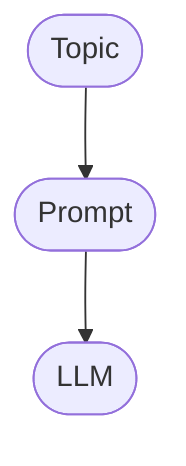
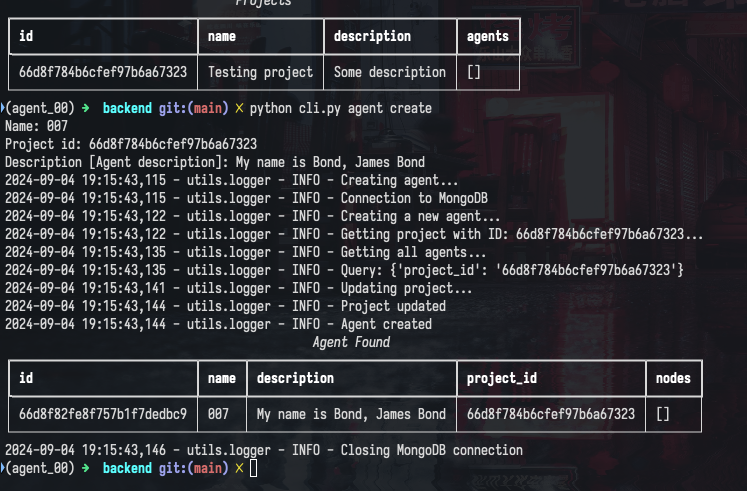
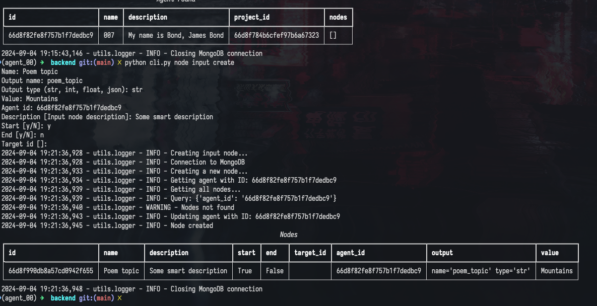
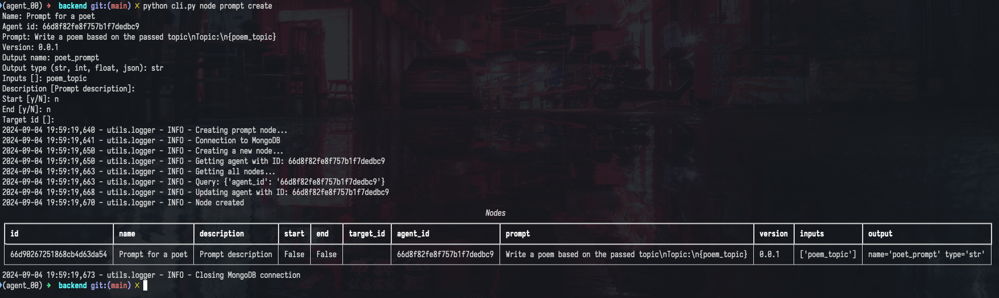
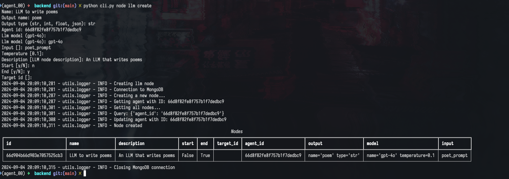
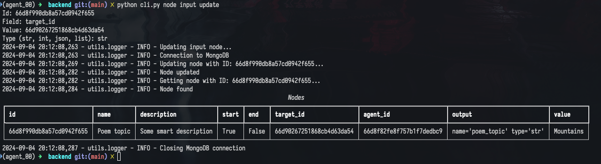
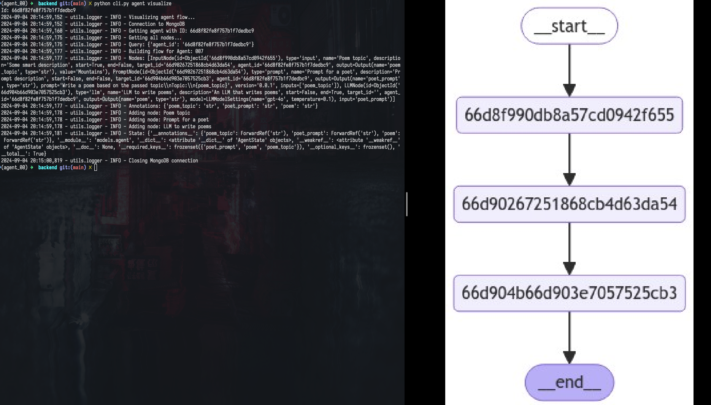
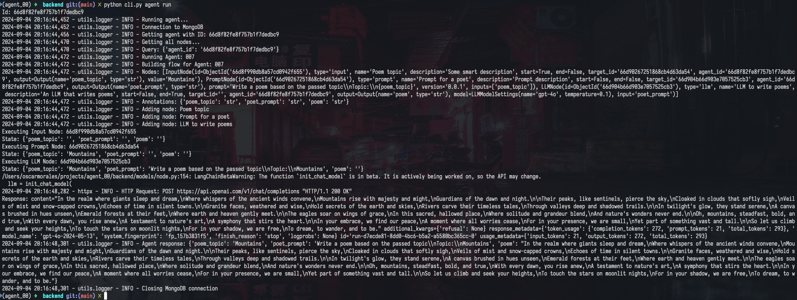

# Agent_00

Agent_00 is a simple app that allows to create flows to automate tasks, and you can include the power of AI. It's built on top of LangGraph

I've built this for fun and maybe has to many bugs, but I've really enjoyed building it and that's what matters.

## Key concepts

### Project

A project is a collection of flows, simple as that.

### Agent

An agent is a collection of nodes that are connected to each other. The agent is the one that represents the flow.

#### Agent state

The agent has a state that is a dictionary that can be used to store information that can be used by the nodes. It's a way to trace the flow of the agent.

### Nodes

Nodes are the building blocks of the agent. There are different types of nodes and key concepts you need to know

#### Input or Inputs

Some nodes can have input(s) that are accessed through the agent state.

#### Output

Some nodes can have an output that is stored in the agent state and accessible by other nodes as an input.

## Requirements

- A running mongodb instance

## Usage

Agent_00 can run in two modes: CLI and API.

### Installation

Right now, the way to run the app is to clone the repository, create a virtual environment and install the requirements.

```bash
git clone url agent_00
cd agent_00
python -m venv venv
source venv/bin/activate
pip install -r requirements.txt
```

### Configuration

You need to create a `.env` file in the root of the project with the following variables:

```bash
MONGODB_CLIENT_URI=mongodb://localhost:27017
MONGODB_DATABASE=agent_00
OPENAI_API_KEY=your_openai_api_key # If you are planning to use the OpenAI API
```

### CLI

The CLI is pretty intuitive, you can run `python cli.py --help` to see the available commands.

CLI tool was written using `Typer` library.

#### Creating a flow

Let's say we want to create a flow with a llm that writes poetry. Diagram looks like this:


Each point in the diagram is a node:

1. input node: Topic. So we the output of this node is the input of prompt node.
2. prompt node: This node is a text node. It takes the input from the previous node and store the output in the agent state that serves as input for llm node.
3. llm node: This use a llm model to generate text. Stores the output in the agent state.

So, let's create the flow:

##### Create a project
```bash
python cli.py project create
```

It will prompt you the required information to create a project. When project is created, the project info will be displayed.


##### Create an agent

```bash
python cli.py agent create
```

It will prompt you the required information to create an agent, Here you will need the project id.



##### Nodes

First, let's start creating the input node:

```bash
python cli.py node input create
```

It will prompt you the required information to create an input node. At this point you don't know the target_id, so you can leave it empty and update it later.



Now, let's create the prompt node:

```bash
python cli.py node prompt create
```

It will prompt you the required information to create a prompt node. At this point you don't know the target_id, so you can leave it empty and update it later.



Notice here that we are using {} as placeholders for the input of the input node (or possibly other nodes).

Next, let's create the llm node:

```bash
python cli.py node llm create
```

It will prompt you the required information to create a llm node.



Finally, let's update the input and prompt nodes with the target_id of the previous nodes:

```bash
python cli.py node input update
```

It will prompt you the required information to update the input node.



```bash
python cli.py node prompt update
```

It will prompt you the required information to update the prompt node.


##### Visualize the flow

You can visualize the flow of the agent by running:

```bash
python cli.py agent visualize
```

It will prompt you the required information to visualize the agent.



##### Run the agent

You can run the agent by running:

```bash
python cli.py agent run
```

It will prompt you the required information to run the agent.



That's it! You've created a flow that generates poetry using a llm model.

### UI

### Next steps

- [ ] Introduce more kind of nodes
- [ ] Introduce more llm models
- [ ] Add unit and integration tests
- [ ] Dockerize the app
- [ ] Build a frontend to interact with the API and build flows as no-code
- [ ] Solve TODOs in the code
- [ ] Implement UI app
